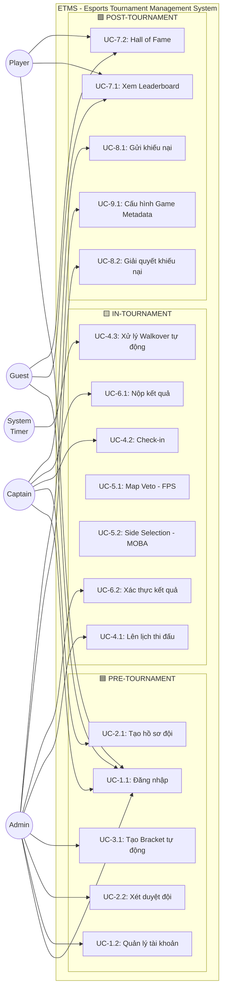
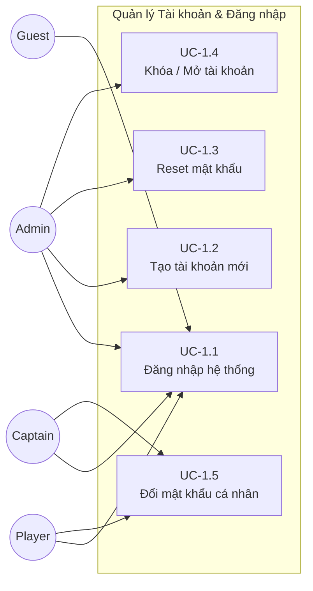
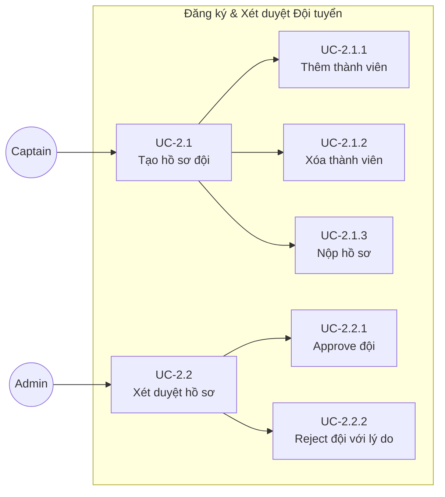
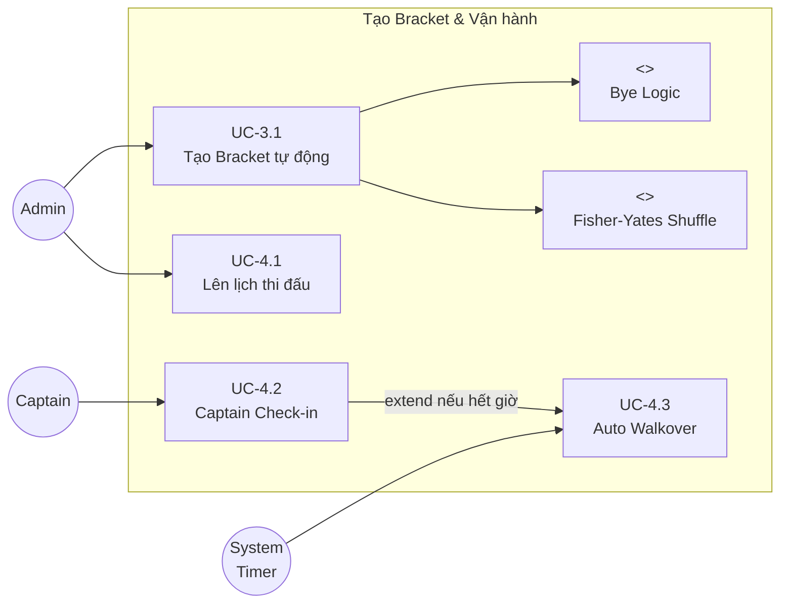
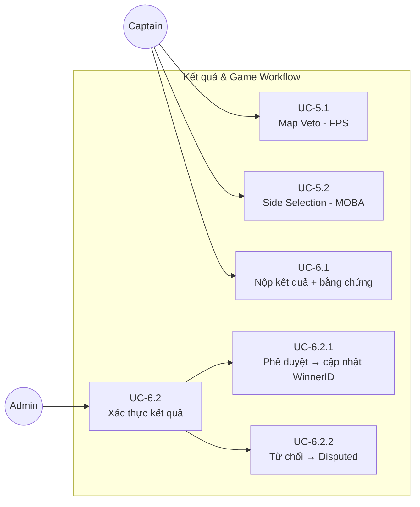
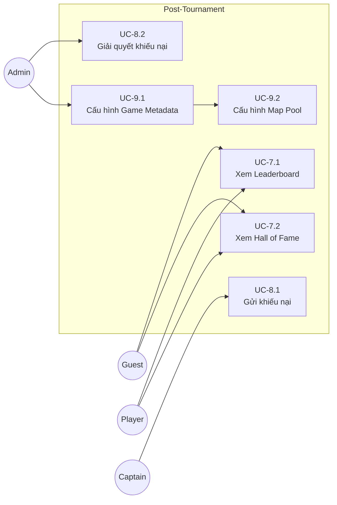

# USE CASE DIAGRAM — ETMS (Hệ thống Quản lý Giải đấu Esports)

> Phiên bản: 1.0 | Môn học: Kỹ thuật Phần mềm 502045 – FIT TDTU

---

## 1. TỔNG QUAN CÁC ACTOR

| Actor | Mô tả | Kế thừa |
|---|---|---|
| **Guest** | Khách vãng lai, không cần đăng nhập | — |
| **Player** | Tuyển thủ đã đăng ký tài khoản | extends Guest |
| **Captain** | Đội trưởng, quản lý đội | extends Player |
| **Admin** | Ban tổ chức, quyền toàn bộ hệ thống | — |
| **System (Timer)** | Tác nhân hệ thống tự động (scheduler) | — |

---

## 2. USE CASE DIAGRAM TỔNG QUAN (Mermaid)

---

## 3. USE CASE DIAGRAM CHI TIẾT THEO NHÓM

### 3.1 Nhóm: Quản lý Tài khoản (FR-1)

### 3.2 Nhóm: Đăng ký & Xét duyệt Đội (FR-2)

### 3.3 Nhóm: Tạo Bracket & Vận hành (FR-3, FR-4)

### 3.4 Nhóm: Kết quả & Game-Specific (FR-5, FR-6)

### 3.5 Nhóm: Post-Tournament (FR-7, FR-8, FR-9)

---

## 4. MÔ TẢ CHI TIẾT TỪNG USE CASE

### UC-1.1: Đăng nhập hệ thống

| Trường | Nội dung |
|---|---|
| **Use Case ID** | UC-1.1 |
| **Tên** | Đăng nhập hệ thống |
| **Actor** | Guest, Player, Captain, Admin |
| **Mức độ** | User Goal |
| **Precondition** | Ứng dụng đang chạy. Tài khoản đã tồn tại và chưa bị khóa. |
| **Trigger** | Người dùng mở ứng dụng |
| **Luồng chính** | 1. Người dùng nhập Username + Password 2. BUS gọi `AuthBUS.Login(username, password)` 3. DAL truy vấn `PasswordHash` từ `tblUser` bằng Parameterized Query 4. BUS so sánh hash nhập vào với hash lưu trữ 5. Khớp → tạo Session với Role tương ứng 6. Chuyển hướng đến Dashboard theo Role |
| **Luồng thay thế A** | Sai mật khẩu → Hiển thị lỗi chung "Thông tin đăng nhập không chính xác" (không tiết lộ field nào sai). Tăng `FailedAttempts` +1 |
| **Luồng thay thế B** | Sai ≥ 5 lần → Khóa tài khoản (`IsLocked = 1`), thông báo liên hệ Admin |
| **Luồng thay thế C** | Tài khoản bị khóa → Hiển thị thông báo, không cho đăng nhập |
| **Postcondition** | Phiên làm việc (Session) được tạo với đúng Role |
| **Ngoại lệ** | DB không kết nối → Hiển thị lỗi kỹ thuật rõ ràng |
| **NFR** | NFR-1.1 (Hash), NFR-1.3 (RBAC), NFR-1.4 (Chặn truy cập) |
| **Màn hình** | `frmLogin.cs` |

---

### UC-1.2: Quản lý tài khoản (Admin)

| Trường | Nội dung |
|---|---|
| **Use Case ID** | UC-1.2 |
| **Actor** | Admin |
| **Precondition** | Admin đã đăng nhập |
| **Luồng chính** | 1. Admin vào phần Quản lý tài khoản 2. Xem danh sách tất cả người dùng 3. Tạo tài khoản mới / Reset mật khẩu / Khóa / Mở khóa 4. Hệ thống cập nhật DB và thông báo kết quả |
| **Ràng buộc** | Username phải là duy nhất. Khi tạo tài khoản, mật khẩu ban đầu phải được hash ngay |
| **Lỗ hổng cần bổ sung** | ⚠️ SRS chưa mô tả rõ quy trình thông báo reset password đến người dùng (email/in-app?) |

---

### UC-2.1: Captain tạo hồ sơ đội

| Trường | Nội dung |
|---|---|
| **Use Case ID** | UC-2.1 |
| **Actor** | Captain |
| **Precondition** | Captain đã đăng nhập. Tournament đang ở trạng thái `Registration`. |
| **Trigger** | Captain chọn "Đăng ký Đội mới" |
| **Luồng chính** | 1. Captain nhập Tên đội, Logo (URL/File), chọn Tournament 2. Thêm thành viên qua InGameID hoặc MSSV 3. BUS validate: tên đội unique, PlayerID không trùng đội khác, đủ số lượng tối thiểu 4. Nộp hồ sơ → Status = `Pending` |
| **Luồng thay thế A** | Thành viên đã thuộc đội khác cùng Tournament → BUS trả lỗi, không thêm |
| **Luồng thay thế B** | Tên đội trùng trong Tournament → Báo lỗi, yêu cầu đổi tên |
| **Luồng thay thế C** | Số thành viên < min → Thông báo cần thêm thành viên |
| **Postcondition** | Bản ghi `tblTeam` với Status = `Pending` được tạo |
| **Màn hình** | `frmTeamManagement.cs` |

---

### UC-2.2: Admin xét duyệt hồ sơ đội

| Trường | Nội dung |
|---|---|
| **Use Case ID** | UC-2.2 |
| **Actor** | Admin |
| **Precondition** | Tồn tại đội có Status = `Pending` |
| **Luồng chính** | 1. Admin xem danh sách đội Pending 2. Kiểm tra từng thành viên, hồ sơ 3a. Approve → Status = `Approved` 3b. Reject → Nhập lý do → Status = `Rejected`, thông báo Captain |
| **Postcondition** | Status đội cập nhật trong `tblTeam` |
| **Lỗ hổng** | ⚠️ Chưa có cơ chế thông báo in-app/email cho Captain khi bị Rejected |

---

### UC-3.1: Tạo Bracket tự động

| Trường | Nội dung |
|---|---|
| **Use Case ID** | UC-3.1 |
| **Actor** | Admin |
| **Precondition** | ≥ 2 đội có Status = `Approved`. Tournament ở trạng thái `Registration`. |
| **Trigger** | Admin click "Generate Bracket" |
| **Luồng chính** | 1. Admin chọn Tournament → "Generate Bracket" 2. BUS lấy danh sách đội Approved 3. Fisher-Yates Shuffle ngẫu nhiên 4. Tính `bye_count = nextPowerOf2(N) - N` 5. Các đội seed cao nhất nhận Bye 6. Tạo cấu trúc Linked List: `MatchID → NextMatchID` 7. DAL INSERT toàn bộ trong 1 SQL Transaction 8. GUI render cây nhánh đấu |
| **Luồng thay thế** | < 2 đội Approved → Thông báo không thể tạo bracket |
| **Postcondition** | Bảng `tblMatch` được điền đầy đủ với Linked List chính xác. Tournament Status = `Active`. |
| **Lỗ hổng quan trọng** | ⚠️ Chưa rõ: Admin có thể tạo lại Bracket không? Nếu có → cần xử lý xóa bracket cũ trước ⚠️ Chưa rõ: Bracket có thể bị sửa thủ công không? |
| **Màn hình** | `frmBracketView.cs` |

---

### UC-4.1: Admin lên lịch thi đấu

| Trường | Nội dung |
|---|---|
| **Use Case ID** | UC-4.1 |
| **Actor** | Admin |
| **Precondition** | Bracket đã được tạo |
| **Luồng chính** | 1. Admin vào quản lý lịch 2. Chọn trận → Đặt `ScheduledTime` 3. Hệ thống tự tính `CheckInOpenTime = ScheduledTime - 15 phút` 4. Lưu vào `tblMatch` |
| **Lỗ hổng** | ⚠️ Thiếu validation: ScheduledTime không được trùng cho cùng 1 đội (scheduling conflict) |

---

### UC-4.2: Captain Check-in

| Trường | Nội dung |
|---|---|
| **Use Case ID** | UC-4.2 |
| **Actor** | Captain, System (Timer) |
| **Trigger** | `CheckInOpenTime` = `ScheduledTime - 15 phút` |
| **Luồng chính** | 1. System Timer mở cổng Check-in (15 phút trước trận) 2. Captain bấm "Xác nhận tham dự" 3. BUS kiểm tra: còn trong cửa sổ Check-in không? 4. DAL UPDATE `CheckIn_TeamX = 1` với SQL Transaction Serializable 5. Nếu cả 2 đội Check-in → Status = `Live` |
| **Luồng thay thế** | Hết cửa sổ Check-in, 1 đội chưa xác nhận → Auto Walkover (UC-4.3) |
| **Race Condition** | DAL dùng `IsolationLevel.Serializable` |
| **Màn hình** | `frmCheckIn.cs` |

---

### UC-4.3: Xử lý Walkover tự động

| Trường | Nội dung |
|---|---|
| **Use Case ID** | UC-4.3 |
| **Actor** | System (Timer) |
| **Trigger** | Hết cửa sổ Check-in (ScheduledTime đã qua) mà 1 hoặc cả 2 đội chưa Check-in |
| **Luồng chính** | 1. Timer kích hoạt `BracketBUS.ApplyWalkover(matchId)` 2. Nếu 1 đội đã Check-in → đội đó thắng Walkover 3. Nếu cả 2 chưa Check-in → Admin quyết định (hoặc đội seed cao hơn thắng) 4. `tblMatch.Status = 'Walkover'`, `WinnerID` được set 5. Tự động cập nhật trận tiếp theo qua `NextMatchID` |
| **Lỗ hổng quan trọng** | ⚠️ Trường hợp cả 2 đội đều không Check-in chưa được xử lý rõ trong SRS |

---

### UC-5.1: Map Veto (FPS)

| Trường | Nội dung |
|---|---|
| **Use Case ID** | UC-5.1 |
| **Actor** | Captain (cả 2 đội) |
| **Precondition** | Trận là FPS (Valorant, CS:GO). Cả 2 đội đã Check-in. |
| **Luồng chính** | 1. Hệ thống hiển thị Map Pool của game 2. Đội 1 ban 1 map → Đội 2 ban 1 map → ... (theo cấu hình Bo1/Bo3/Bo5) 3. Map cuối còn lại = bản đồ thi đấu 4. Lưu vào `tblMapVeto` |
| **Lỗ hổng** | ⚠️ Chưa định rõ thứ tự veto (ai ban trước?). Cần bổ sung quy tắc (đội hạt giống thấp hơn ban trước?) |

---

### UC-5.2: Side Selection (MOBA)

| Trường | Nội dung |
|---|---|
| **Use Case ID** | UC-5.2 |
| **Actor** | Captain (đội được chọn) |
| **Precondition** | Trận là MOBA (LoL, Dota 2). Cả 2 đội đã Check-in. |
| **Luồng chính** | 1. Đội thắng coin toss random hoặc seed cao hơn được quyền chọn 2. Chọn Blue Side hoặc Red Side 3. Lưu vào `tblSideSelect` |
| **Lỗ hổng** | ⚠️ Cơ chế coin toss chưa được mô tả rõ (random thuần hay có seed?) |

---

### UC-6.1: Captain nộp kết quả

| Trường | Nội dung |
|---|---|
| **Use Case ID** | UC-6.1 |
| **Actor** | Captain (đội thắng) |
| **Precondition** | Trận ở trạng thái `Live` hoặc đã kết thúc thực tế |
| **Luồng chính** | 1. Captain truy cập trận → "Nộp kết quả" 2. Nhập Score1, Score2 3. Upload ảnh bằng chứng (.jpg/.png, < 5MB) 4. BUS validate file (extension + size) 5. DAL INSERT `tblMatchResult` với Status = `PendingVerification` |
| **Luồng thay thế A** | File > 5MB → Từ chối, báo lỗi |
| **Luồng thay thế B** | File không phải .jpg/.png → Từ chối, báo lỗi |
| **Lỗ hổng** | ⚠️ Cả 2 Captain đều có thể nộp kết quả không? Nếu 2 Captain nộp điểm số khác nhau → conflict chưa được xử lý |
| **Màn hình** | `frmResultSubmit.cs` |

---

### UC-6.2: Admin xác thực kết quả

| Trường | Nội dung |
|---|---|
| **Use Case ID** | UC-6.2 |
| **Actor** | Admin |
| **Precondition** | Tồn tại `tblMatchResult` với Status = `PendingVerification` |
| **Luồng chính** | 1. Admin xem ảnh bằng chứng 2. Phê duyệt → BUS set `WinnerID`, Status = `Completed` 3. BUS tự động đẩy WinnerID vào trận `NextMatchID` 4. Tất cả trong SQL Transaction |
| **Luồng thay thế** | Từ chối → Status = `Disputed`, thông báo Captain |
| **Lỗ hổng** | ⚠️ Khi `Disputed`: quy trình resolve chưa rõ (Captain nộp lại? Admin tự nhập?) |

---

### UC-7.1: Xem Leaderboard

| Trường | Nội dung |
|---|---|
| **Use Case ID** | UC-7.1 |
| **Actor** | Guest, Player, Admin |
| **Precondition** | Không cần đăng nhập (Guest có thể xem) |
| **Luồng chính** | 1. Người dùng chọn Tournament 2. Với Single Elimination: Hiển thị cây bracket đã hoàn thành 3. Với Battle Royale: Sort theo Tie-breaker Algorithm 4. Hiển thị Top 3: 🥇🥈🥉 |
| **Tie-breaker** | `ORDER BY TotalPoints DESC, DirectHeadToHead DESC, TotalKillPoints DESC` |
| **Màn hình** | `frmLeaderboard.cs` |

---

### UC-8.1: Gửi khiếu nại

| Trường | Nội dung |
|---|---|
| **Use Case ID** | UC-8.1 |
| **Actor** | Captain |
| **Precondition** | Captain đã đăng nhập. Trận đấu có thể bị khiếu nại (Status ≠ Draft). |
| **Luồng chính** | 1. Captain chọn trận → "Khiếu nại" 2. Nhập nội dung (hack/cheat/người ngoài danh sách) 3. Upload bằng chứng (video/screenshot) 4. `DisputeBUS.FileDispute()` lưu vào `tblDispute` 5. Admin nhận thông báo |
| **Lỗ hổng** | ⚠️ Giới hạn số lần khiếu nại chưa được định nghĩa. Không giới hạn → Captain có thể spam khiếu nại |
| **Màn hình** | `frmDisputeManage.cs` |

---

### UC-9.1: Cấu hình Game Metadata

| Trường | Nội dung |
|---|---|
| **Use Case ID** | UC-9.1 |
| **Actor** | Admin |
| **Luồng chính** | 1. Admin cấu hình cho từng game: Bo1/Bo3/Bo5, Map Pool, số người/đội, điểm ranking, kill points 2. Lưu vào `tblTournament` hoặc bảng config riêng |
| **Lỗ hổng** | ⚠️ Không có bảng `tblGameConfig` riêng trong schema — thông tin được embed vào `tblTournament` nhưng không đủ cột |

---

## 5. BẢNG TỔNG HỢP LỖ HỔNG PHÁT HIỆN

| ID | Loại | Mô tả | Mức độ |
|---|---|---|---|
| **GAP-01** | Logic | Cả 2 đội không Check-in: chưa xử lý rõ ràng | 🔴 Cao |
| **GAP-02** | Logic | Captain nộp kết quả mâu thuẫn nhau: chưa có conflict resolution | 🔴 Cao |
| **GAP-03** | Bảo mật | Không có cơ chế thông báo reset password (email/in-app) | 🟡 Trung bình |
| **GAP-04** | Logic | Admin tạo lại Bracket: chưa có quy trình xóa bracket cũ | 🟡 Trung bình |
| **GAP-05** | Logic | Thứ tự Map Veto chưa được quy định rõ (ai ban trước) | 🟡 Trung bình |
| **GAP-06** | Logic | Không giới hạn số lần Captain gửi khiếu nại → spam | 🟡 Trung bình |
| **GAP-07** | DB | Thiếu bảng `tblGameConfig` để lưu cấu hình game metadata | 🟡 Trung bình |
| **GAP-08** | Logic | Scheduling conflict: lịch đấu trùng cho 1 đội chưa được kiểm tra | 🟡 Trung bình |
| **GAP-09** | Bảo mật | File upload: chỉ kiểm tra extension, không kiểm tra MIME type → dễ bypass | 🔴 Cao |
| **GAP-10** | Logic | Coin toss Side Selection chưa rõ cơ chế random (có seed không?) | 🟢 Thấp |
