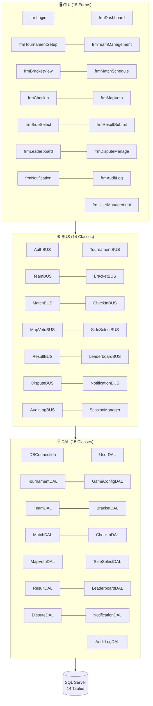
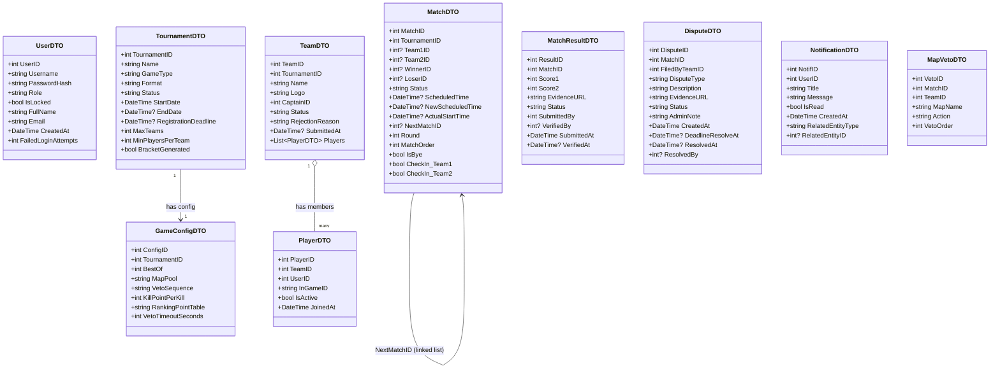
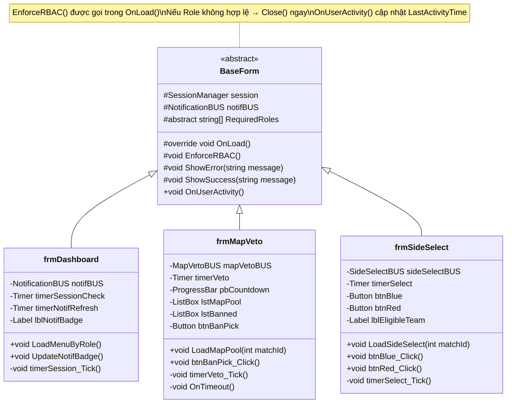

# CLASS DIAGRAM v2.0 — ETMS (Hoàn chỉnh)

> Bổ sung toàn bộ classes còn thiếu: MapVetoBUS, SideSelectBUS, GameConfigDAL, NotificationBUS/DAL, AuditLogBUS/DAL

---

## 1. KIẾN TRÚC TỔNG QUAN v2.0



---

## 2. DTO LAYER — Hoàn chỉnh



---

## 3. BUS LAYER — Đầy đủ với Classes Mới

```mermaid
classDiagram
    class MapVetoBUS {
        -GameConfigDAL configDAL
        -MapVetoDAL vetoDAL
        +void StartVeto(int matchId)
        +bool SubmitVetoAction(int matchId, int teamId, string mapName, string action)
        +List~string~ GetRemainingMaps(int matchId)
        +string DetermineFirstTeam(int matchId)
        +bool IsVetoComplete(int matchId)
        +void AutoBanOnTimeout(int matchId, int currentTeamId)
        -bool ValidateAction(string action, string vetoSequence, int vetoOrder)
    }

    class SideSelectBUS {
        -SideSelectDAL sideDAL
        +int DetermineFirstPick(int matchId)
        +bool SubmitSideSelection(int matchId, int teamId, string side)
        +void AutoSelectOnTimeout(int matchId, int eligibleTeamId)
        -int GenerateCoinToss(int matchId)
    }

    class NotificationBUS {
        -NotificationDAL notifDAL
        +void Notify(int userId, string title, string message, string entityType, int entityId)
        +void NotifyTeamApproved(int captainId, string teamName)
        +void NotifyTeamRejected(int captainId, string teamName, string reason)
        +void NotifyCheckInOpen(int team1CaptainId, int team2CaptainId, int matchId)
        +void NotifyWalkover(int captainId, string result)
        +void NotifyResultPending(int adminId, int matchId)
        +void NotifyResultRejected(int captainId, int matchId, string reason)
        +void NotifyDisputeFiled(int adminId, int disputeId)
        +void NotifyPasswordReset(int userId, string tempPassword)
        +List~NotificationDTO~ GetUnreadNotifications(int userId)
        +bool MarkAsRead(int notifId, int userId)
        +int GetUnreadCount(int userId)
    }

    class AuditLogBUS {
        -AuditLogDAL auditDAL
        +void Log(int userId, string action, string detail, string entity, int entityId)
        +void LogLogin(int userId)
        +void LogLogout(int userId)
        +void LogTeamApprove(int adminId, int teamId)
        +void LogTeamReject(int adminId, int teamId, string reason)
        +void LogGenerateBracket(int adminId, int tournamentId)
        +void LogResultApprove(int adminId, int matchId)
        +void LogLockAccount(int adminId, int targetUserId)
        +List~AuditLogDTO~ GetLogs(DateTime from, DateTime to, string action)
    }

    class SessionManager {
        <<Singleton>>
        -static SessionManager _instance
        +UserDTO CurrentUser
        +DateTime LastActivityTime
        -int TimeoutMinutes
        +static SessionManager GetInstance()
        +void SetUser(UserDTO user)
        +bool HasRole(string role)
        +bool IsSessionValid()
        +void UpdateActivity()
        +void ClearSession()
    }

    class AuthBUS {
        -UserDAL userDAL
        -NotificationBUS notifBUS
        -AuditLogBUS auditBUS
        -SessionManager session
        +LoginResult Login(string username, string password)
        +void Logout()
        +bool ChangePassword(int userId, string oldPwd, string newPwd)
        +bool ResetPassword(int userId)
        +bool LockAccount(int targetUserId, int adminId)
        +bool UnlockAccount(int targetUserId, int adminId)
        -string HashPassword(string plain)
        -bool VerifyPassword(string plain, string hash)
    }

    class ResultBUS {
        -ResultDAL resultDAL
        -MatchDAL matchDAL
        -BracketDAL bracketDAL
        -NotificationBUS notifBUS
        -AuditLogBUS auditBUS
        +SubmitResult_Result SubmitResult(int matchId, int score1, int score2, string filePath, int captainId)
        +bool ApproveResult(int matchId, int winnerId, int adminId)
        +bool RejectResult(int matchId, string reason, int adminId)
        +bool OverrideResult(int matchId, int newWinnerId, int adminId)
        -ValidationResult ValidateFile(string filePath)
        -bool ValidateExtension(string filePath)
        -bool ValidateMagicBytes(string filePath)
        -bool ValidateSize(string filePath)
        -void AdvanceWinner(int matchId, int winnerId)
    }

    class DisputeBUS {
        -DisputeDAL disputeDAL
        -NotificationBUS notifBUS
        -AuditLogBUS auditBUS
        +FileDisputeResult FileDispute(DisputeDTO dto, int captainId)
        +bool ResolveDispute(int disputeId, string note, int adminId, bool overrideResult, int? newWinnerId)
        +bool DismissDispute(int disputeId, string note, int adminId)
        +List~DisputeDTO~ GetOpenDisputes()
        +void CheckOverdueSLAAndNotify()
        -bool HasReachedDisputeLimit(int teamId, int tournamentId)
    }

    class CheckInBUS {
        -CheckInDAL checkInDAL
        -MatchDAL matchDAL
        -NotificationBUS notifBUS
        -BracketBUS bracketBUS
        +bool ConfirmCheckIn(int matchId, int teamId)
        +bool IsCheckInWindowOpen(int matchId)
        +WalkoverResult ProcessWalkoverOnTimeout(int matchId)
        +bool HandleWalkoverPendingDecision(int matchId, int? winnerId, int adminId)
    }

    class BracketBUS {
        -TeamDAL teamDAL
        -BracketDAL bracketDAL
        -NotificationBUS notifBUS
        -AuditLogBUS auditBUS
        -IBracketStrategy _strategy
        +BracketDTO GenerateBracket(int tournamentId)
        +bool RegenerateBracket(int tournamentId, int adminId)
        +BracketDTO GetBracket(int tournamentId)
        +bool ApplyWalkover(int matchId, int winnerId)
        +void SetStrategy(IBracketStrategy strategy)
        -List~TeamDTO~ ShuffleTeams(List~TeamDTO~ teams)
        -int NextPowerOf2(int n)
    }

    class IBracketStrategy {
        <<interface>>
        +BracketDTO Generate(List~TeamDTO~ teams, int tournamentId)
        +string GetFormatName()
    }
    class SingleEliminationStrategy {
        +BracketDTO Generate(List~TeamDTO~ teams, int tournamentId)
        +string GetFormatName()
    }
    class BattleRoyaleStrategy {
        +BracketDTO Generate(List~TeamDTO~ teams, int tournamentId)
        +string GetFormatName()
    }
    IBracketStrategy <|.. SingleEliminationStrategy
    IBracketStrategy <|.. BattleRoyaleStrategy
    BracketBUS --> IBracketStrategy
```



---

## 4. DAL LAYER — Classes Mới

```mermaid
classDiagram
    class GameConfigDAL {
        -DBConnection db
        +bool SaveConfig(GameConfigDTO config)
        +bool UpdateConfig(GameConfigDTO config)
        +GameConfigDTO GetConfig(int tournamentId)
    }

    class MapVetoDAL {
        -DBConnection db
        +bool InsertVetoAction(MapVetoDTO dto)
        +List~MapVetoDTO~ GetVetoHistory(int matchId)
        +int GetVetoCount(int matchId)
    }

    class SideSelectDAL {
        -DBConnection db
        +bool InsertSideSelection(int matchId, int teamId, string side)
        +SideSelectDTO GetSelection(int matchId)
    }

    class NotificationDAL {
        -DBConnection db
        +int InsertNotification(NotificationDTO dto)
        +List~NotificationDTO~ GetByUser(int userId, bool unreadOnly)
        +bool MarkAsRead(int notifId)
        +int GetUnreadCount(int userId)
    }

    class AuditLogDAL {
        -DBConnection db
        +bool InsertLog(int userId, string action, string detail, string entity, int entityId)
        +List~AuditLogDTO~ QueryLogs(DateTime from, DateTime to, string action)
    }
```



---

## 5. GUI — BaseForm với RBAC Hoàn chỉnh



---

## 6. ENUM TYPES

```csharp
// Thay thế các magic strings / int tham số
public enum UserRole { Admin, Captain, Player, Guest }
public enum TournamentStatus { Draft, Registration, Active, Completed, Cancelled }
public enum TeamStatus { Pending, Approved, Rejected, Disqualified }
public enum MatchStatus {
    Scheduled, Postponed, CheckInOpen, Live,
    PendingVerification, Completed, Walkover, WalkoverPending, Disputed, Cancelled
}
public enum ResultStatus { PendingVerification, Verified, Disputed }
public enum DisputeStatus { Open, Resolved, Dismissed }
public enum DisputeType { HackCheat, WrongScore, InvalidPlayer, Other }
public enum VetoAction { Ban, Pick }
public enum Side { Blue, Red }
public enum CheckInTarget { Team1, Team2 }   // Thay thế teamNum: int

// LoginResult enum thay thế bool return
public enum LoginResult { Success, WrongPassword, AccountLocked, NotFound, DBError }

// File validation result
public enum FileValidationResult { Valid, InvalidExtension, InvalidMagicBytes, FileTooLarge }
```

---

## 7. TỔNG HỢP THAY ĐỔI SO VỚI v1.0

| Thành phần | v1.0 | v2.0 | Lý do |
|---|---|---|---|
| BUS Classes | 8 | 14 | Thêm MapVetoBUS, SideSelectBUS, NotificationBUS, AuditLogBUS, TournamentBUS, SessionManager |
| DAL Classes | 9 | 15 | Thêm GameConfigDAL, MapVetoDAL, SideSelectDAL, NotificationDAL, AuditLogDAL, TournamentDAL |
| GUI Forms | 11 | 15 | Thêm frmSideSelect, frmNotification, frmAuditLog, frmUserManagement |
| DB Tables | 12 | 14 | Thêm tblGameConfig, tblNotification |
| Enums | 0 | 10 | Tránh magic strings, tăng type safety |
| DTO Classes | 9 | 12 | Thêm GameConfigDTO, NotificationDTO, MapVetoDTO |
