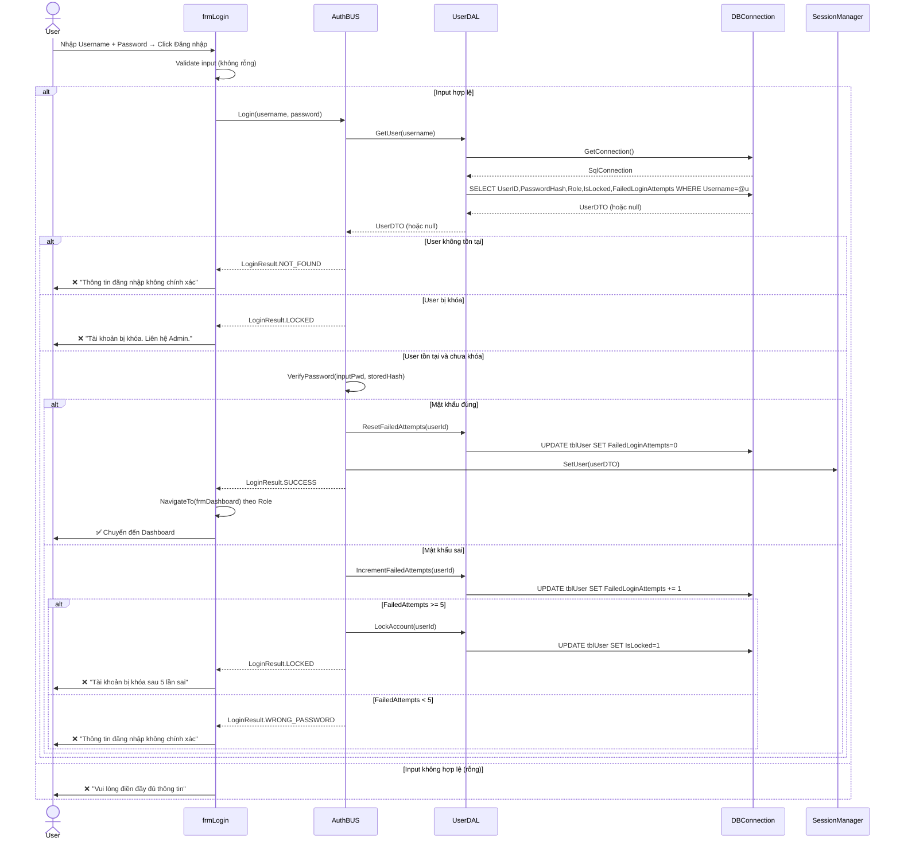
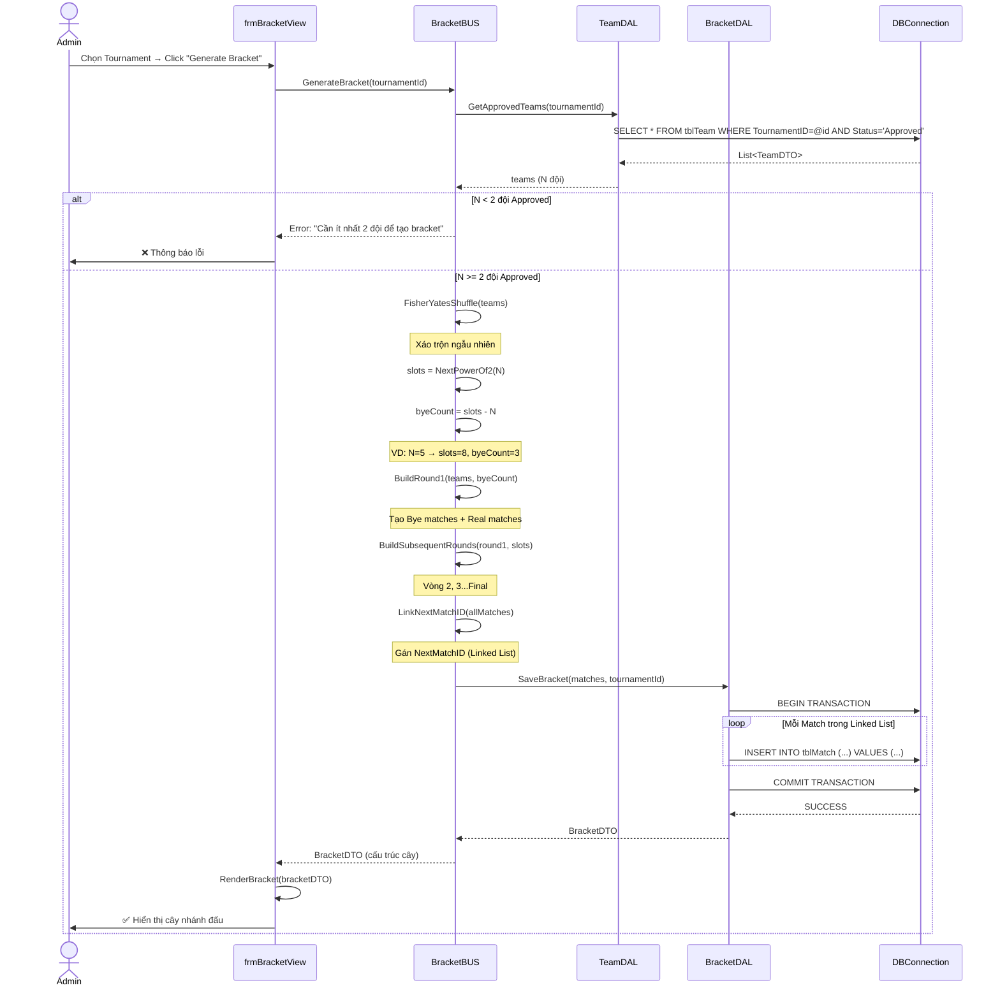
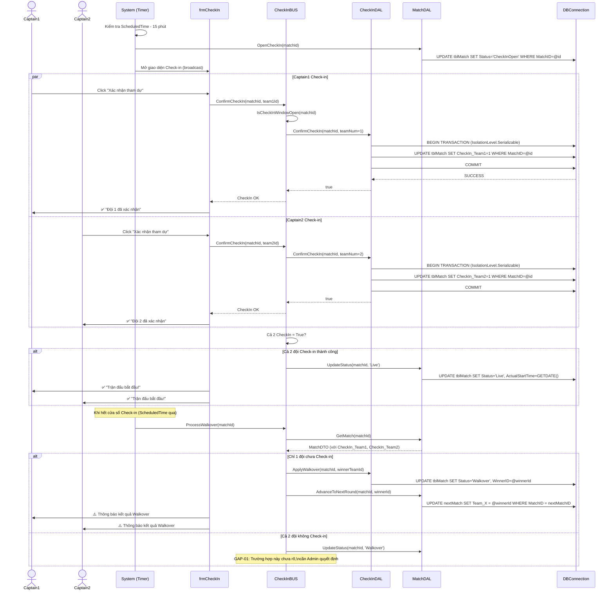
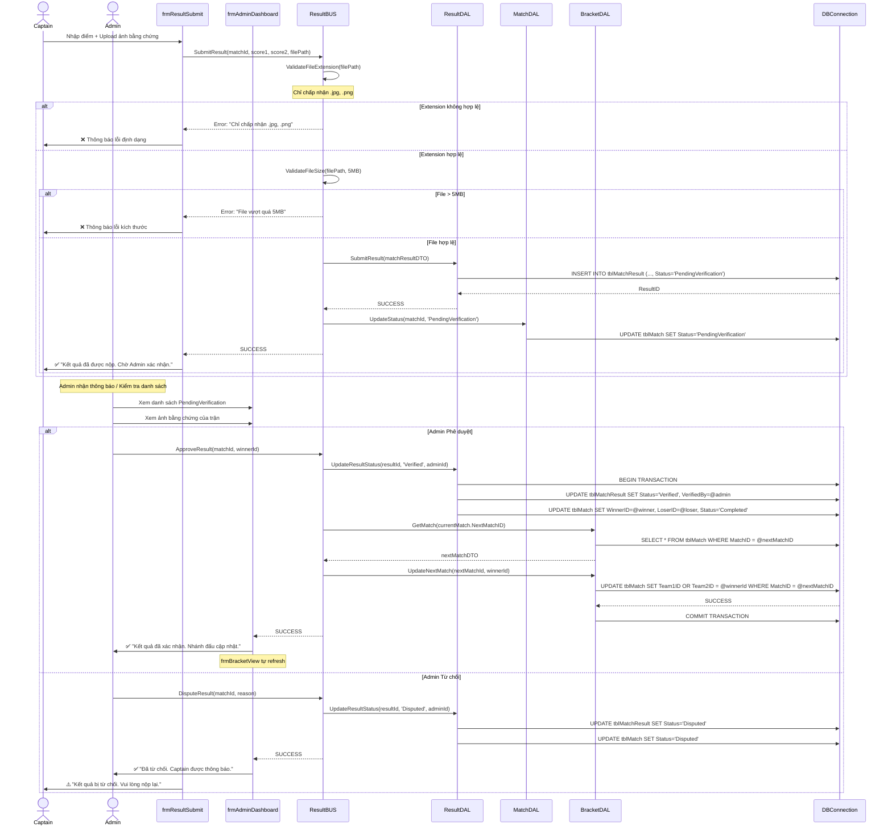
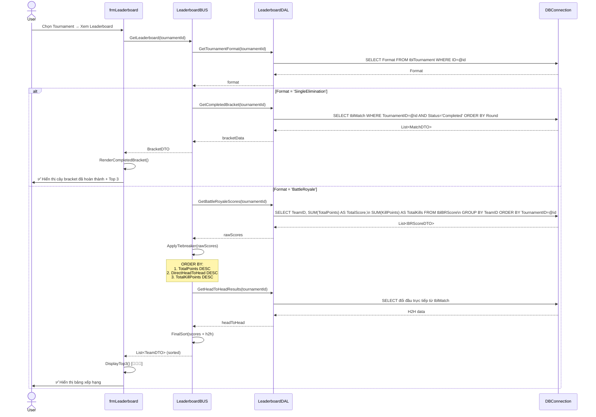
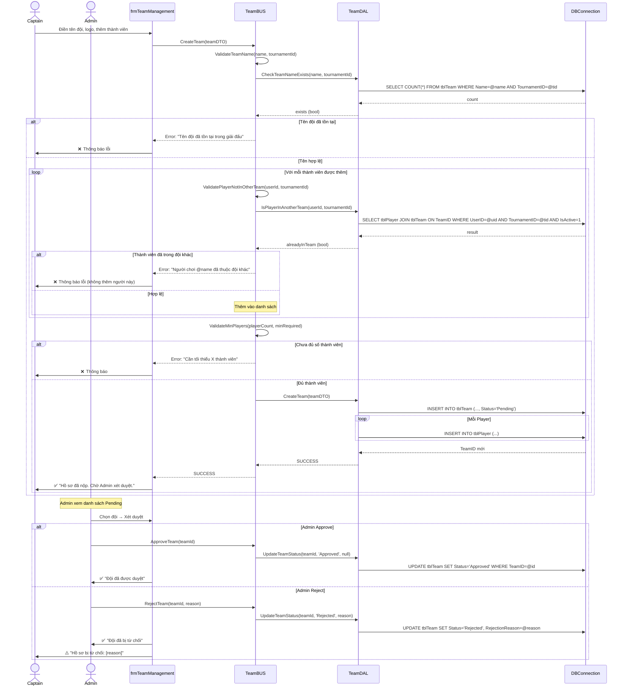

# SEQUENCE DIAGRAMS — ETMS (5 Luồng cốt lõi)

> Hệ thống Quản lý Giải đấu Esports | Phiên bản: 1.0

---

## SD-01: Đăng nhập hệ thống (Login)

---

## SD-02: Tạo Bracket tự động (Generate Bracket)

---

## SD-03: Check-in & Auto Walkover

---

## SD-04: Nộp & Xác thực Kết quả

---

## SD-05: Xem Leaderboard & Tie-breaker (Battle Royale)

---

## SD-06: Đăng ký & Xét duyệt Đội (Team Registration)

