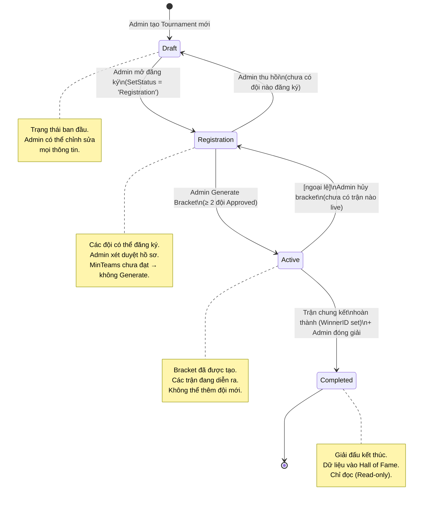
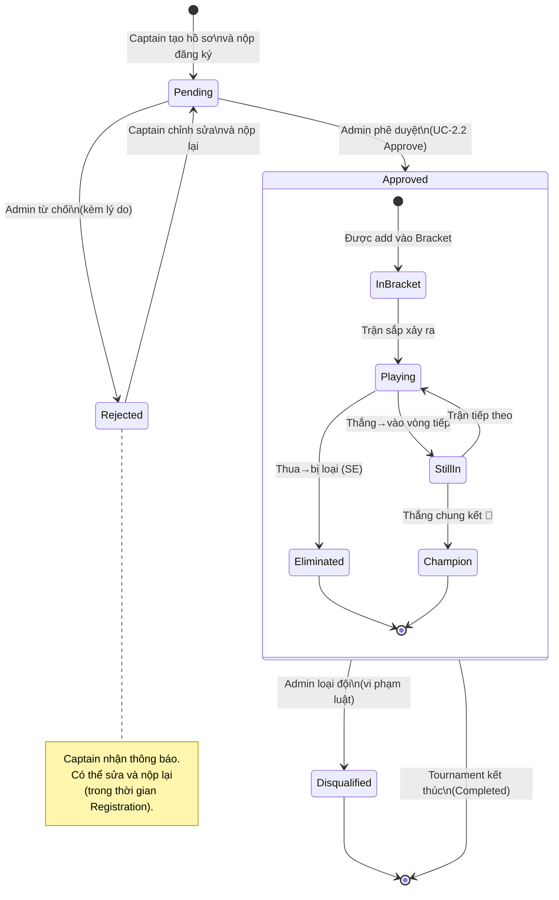
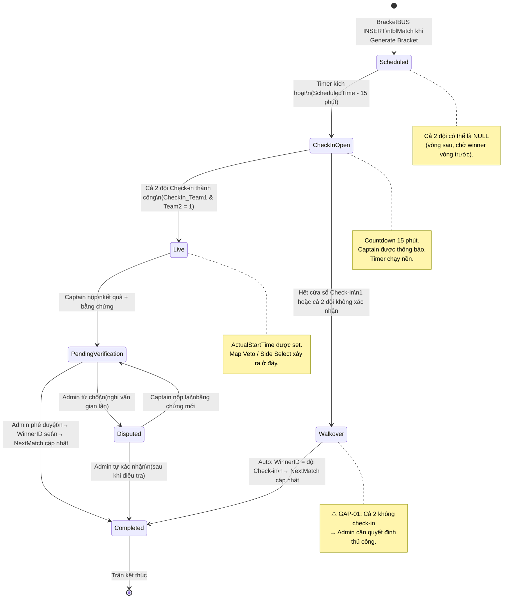
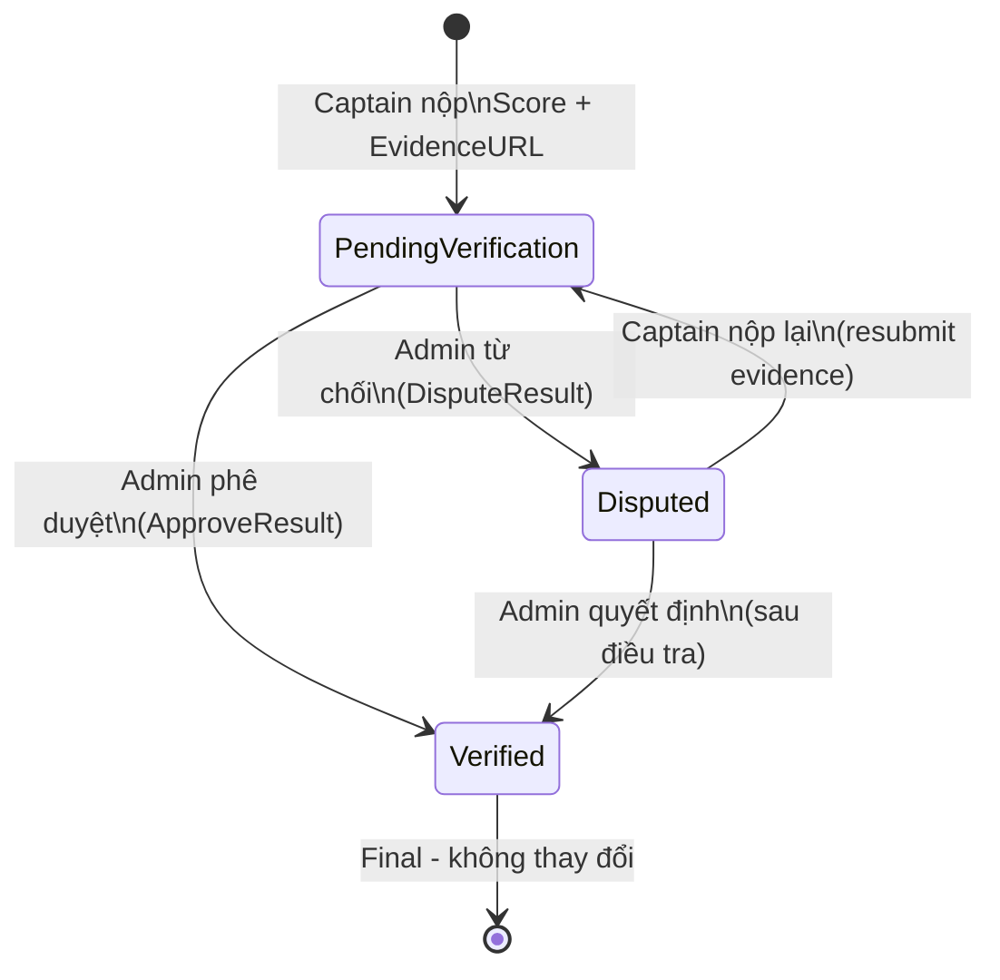
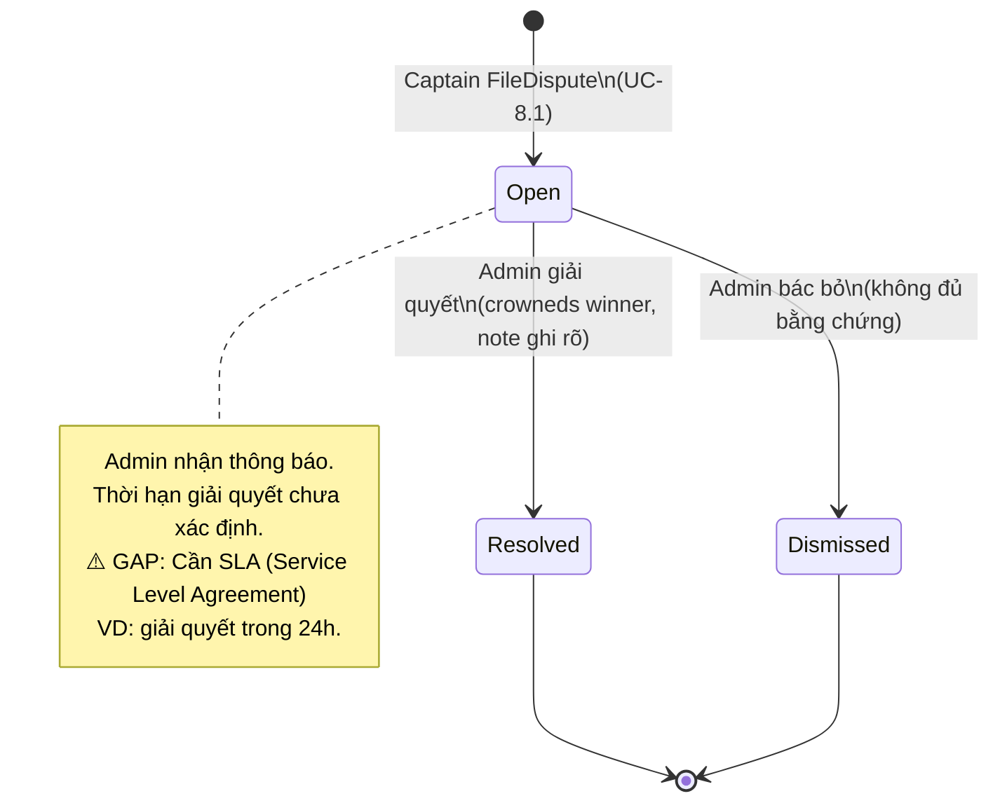
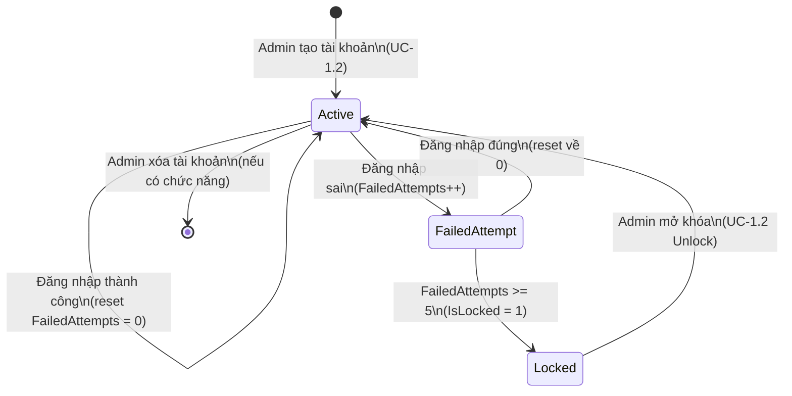

# STATE DIAGRAMS — ETMS (Vòng đời các thực thể chính)

> Hệ thống Quản lý Giải đấu Esports | Phiên bản: 1.0

---

## 1. STATE DIAGRAM — Vòng đời TOURNAMENT

---

## 2. STATE DIAGRAM — Vòng đời TEAM (Đội tuyển)

---

## 3. STATE DIAGRAM — Vòng đời MATCH (Trận đấu)

---

## 4. STATE DIAGRAM — Vòng đời MATCH RESULT (Kết quả)

---

## 5. STATE DIAGRAM — Vòng đời DISPUTE (Khiếu nại)

---

## 6. STATE DIAGRAM — USER ACCOUNT (Tài khoản)

---

## 7. BẢNG TỔNG HỢP TRẠNG THÁI

### 7.1 Match Status

| Status | Ý nghĩa | Transition từ | Transition đến |
|---|---|---|---|
| `Scheduled` | Đã lên lịch, chờ giờ | BracketBUS Generate | `CheckInOpen` |
| `CheckInOpen` | Cổng Check-in mở | Time trigger | `Live` / `Walkover` |
| `Live` | Đang thi đấu | Cả 2 Check-in | `PendingVerification` |
| `Walkover` | Thắng do không Check-in | Timeout | `Completed` |
| `PendingVerification` | Chờ Admin xác nhận | Captain Submit | `Completed` / `Disputed` |
| `Disputed` | Đang tranh chấp | Admin Reject | `PendingVerification` / `Completed` |
| `Completed` | Hoàn thành | Admin Approve | — |

### 7.2 Team Status

| Status | Ý nghĩa |
|---|---|
| `Pending` | Đã nộp, chờ xét duyệt |
| `Approved` | Được chấp thuận, vào bracket |
| `Rejected` | Bị từ chối (có thể nộp lại) |
| `Disqualified` | Bị loại (vi phạm nghiêm trọng) |

### 7.3 Tournament Status

| Status | Ý nghĩa |
|---|---|
| `Draft` | Đang cấu hình |
| `Registration` | Đang nhận hồ sơ đội |
| `Active` | Giải đang diễn ra |
| `Completed` | Đã kết thúc |

---

## 8. LỖ HỔNG PHÁT HIỆN QUA STATE DIAGRAMS

| ID | Lỗ hổng | Mô tả | Khuyến nghị |
|---|---|---|---|
| **ST-01** | Match `Walkover` khi cả 2 không check-in | Không có xử lý tự động | Admin cần xử lý thủ công; thêm trạng thái `WalkoverPending` |
| **ST-02** | Không có Timeout cho `Disputed` | Dispute có thể tồn tại vô thời hạn | Thêm `DeadlineResolveAt = CreatedAt + 24h` |
| **ST-03** | Không có trạng thái `Cancelled` cho Tournament | Tournament `Active` có thể bị hủy bởi sự cố | Thêm trạng thái `Cancelled` với logic xử lý đội tham gia |
| **ST-04** | Không có trạng thái `Postponed` cho Match | Trận có thể bị hoãn | Thêm `Postponed` với `NewScheduledTime` |
| **ST-05** | Match `Disputed` → Captain "nộp lại" chưa rõ quy trình | Ai được nộp? Cả 2 hay chỉ đội bị tố? | Cần specify rõ trong SRS |
