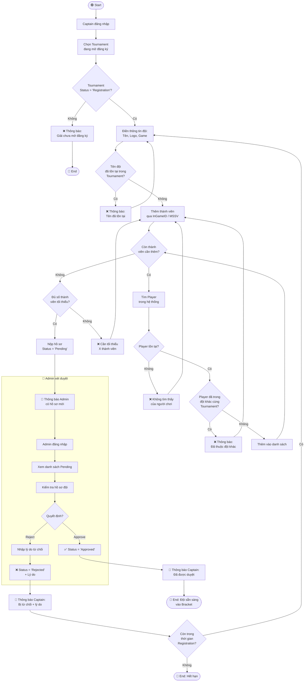
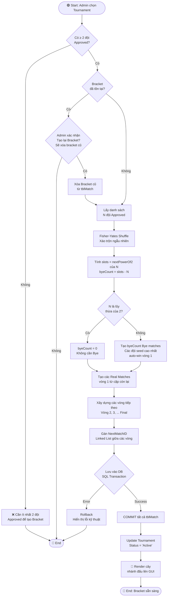
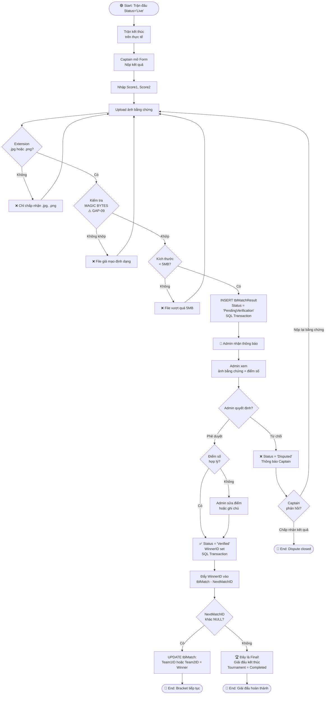
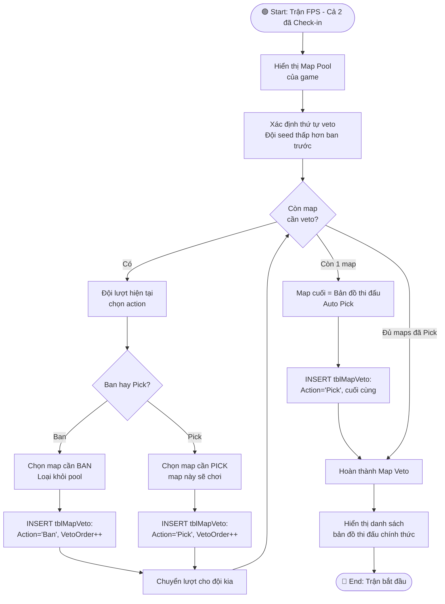
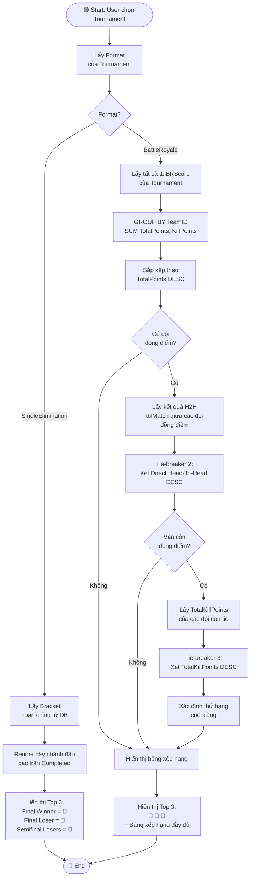
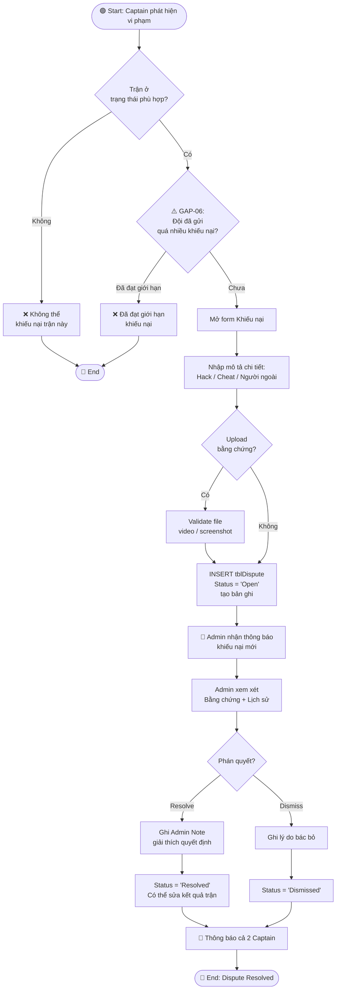

# ACTIVITY DIAGRAMS — ETMS (Luồng nghiệp vụ chi tiết)

> Hệ thống Quản lý Giải đấu Esports | Phiên bản: 1.0

---

## AD-01: Luồng Đăng ký Đội & Xét duyệt



---

## AD-02: Luồng Tạo Bracket & Phân chia Nhánh đấu



---

## AD-03: Luồng Check-in & Quản lý Trận đấu

```mermaid
flowchart TD
    Start([🟢 Start: Đến giờ ScheduledTime - 15'']) --> OpenCheckIn[System Timer\nMở cổng Check-in\nStatus = 'CheckInOpen']
    OpenCheckIn --> NotifyBoth[📢 Thông báo cả 2 Captain\nmở cổng Check-in]
    NotifyBoth --> WaitCheckIn{Waiting for\nCheck-in...}

    WaitCheckIn -->|Captain1 bấm| Cap1CheckIn[CheckIn_Team1 = 1\nSQL Transaction Serializable]
    WaitCheckIn -->|Captain2 bấm| Cap2CheckIn[CheckIn_Team2 = 1\nSQL Transaction Serializable]
    WaitCheckIn -->|Hết giờ| TimeoutCheck

    Cap1CheckIn --> BothChecked1{Cả 2 đội\nđã Check-in?}
    Cap2CheckIn --> BothChecked2{Cả 2 đội\nđã Check-in?}
    
    BothChecked1 -- Có --> StartMatch
    BothChecked1 -- Không --> WaitCheckIn
    BothChecked2 -- Có --> StartMatch
    BothChecked2 -- Không --> WaitCheckIn
    
    StartMatch[Status = 'Live'\nActualStartTime = NOW()] --> GamePlay[🎮 Trận đấu diễn ra\nMap Veto / Side Select\nnếu cần]

    TimeoutCheck{Ai Check-in?}
    TimeoutCheck -- Đội 1 đã CI\nĐội 2 chưa CI --> Walkover2[WinnerID = Team1\nStatus = 'Walkover']
    TimeoutCheck -- Đội 2 đã CI\nĐội 1 chưa CI --> Walkover1[WinnerID = Team2\nStatus = 'Walkover']
    TimeoutCheck -- Cả 2 chưa CI --> BothNoCI[⚠️ GAP-01:\nAdmin quyết định\nthủ công]

    Walkover1 --> AutoAdvance
    Walkover2 --> AutoAdvance
    BothNoCI --> AdminManual[Admin chọn Winner\nhoặc hủy trận]
    AdminManual --> AutoAdvance

    AutoAdvance[Tự động đẩy WinnerID\nvào NextMatchID\nSQL Transaction] --> End1([🔴 End: Walkover xử lý xong])
    GamePlay --> End2([🔴 End: Đang thi đấu])
```

---

## AD-04: Luồng Nộp & Xác thực Kết quả



---

## AD-05: Luồng Map Veto (FPS Games)



---

## AD-06: Luồng Xem Leaderboard (Battle Royale Tie-breaker)



---

## AD-07: Luồng Gửi & Giải quyết Khiếu nại


