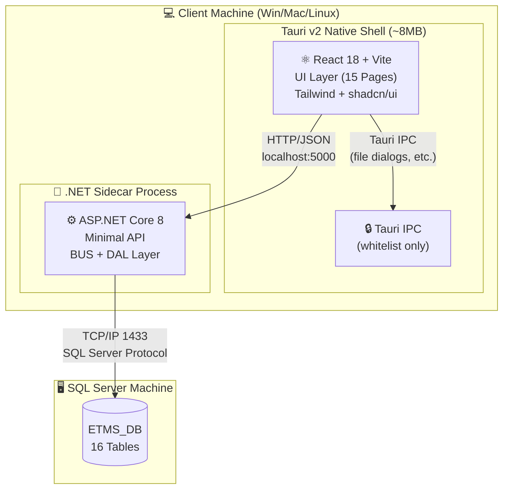
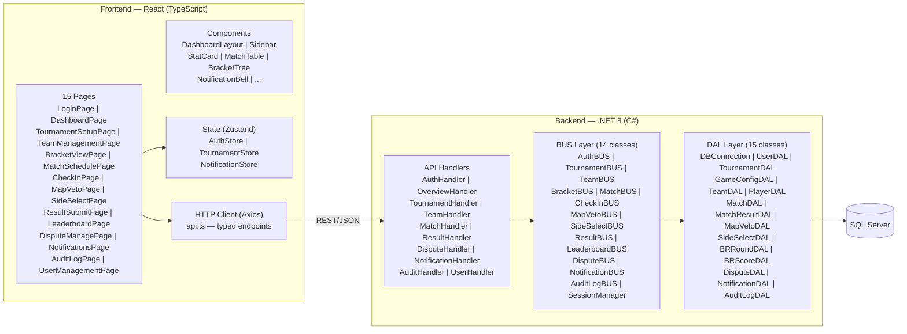
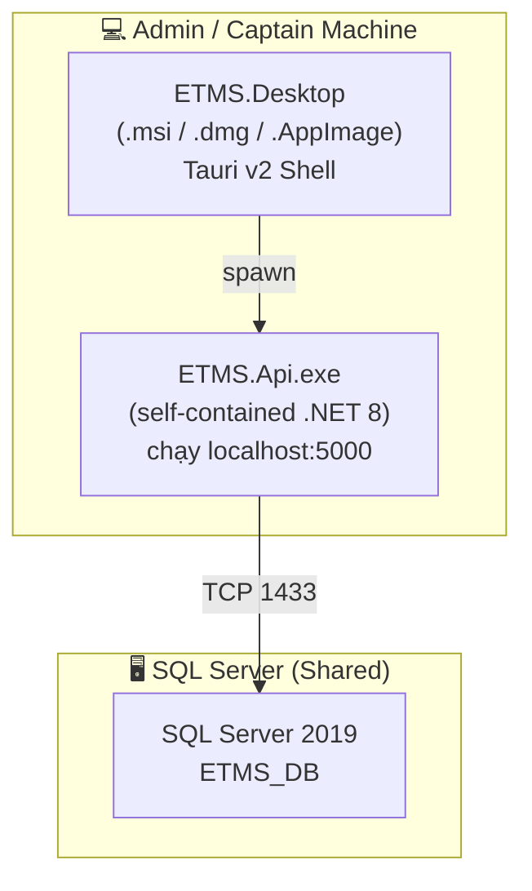
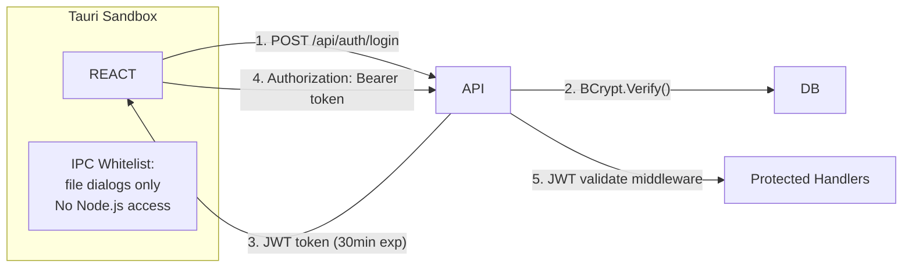

# KIẾN TRÚC HỆ THỐNG — ETMS v4.0
## Architecture Design Document (ADD)
**Phiên bản:** 4.0 (Tauri v2 + React + .NET API) | **Ngày:** 2026-03-31

---

## 1. KIẾN TRÚC TỔNG THỂ



> **Loại kiến trúc:** 3-Tier (Presentation – Business – Data)
> - **Tier 1:** React UI trong Tauri shell (OS WebView, không cần Chromium)
> - **Tier 2:** ASP.NET Core API (BUS/DAL/DTO) chạy như sidecar process
> - **Tier 3:** SQL Server 2019+
> - **IPC:** React giao tiếp API qua `fetch(localhost:5000)` — Tauri IPC dùng cho OS features

---

## 2. KIẾN TRÚC COMPONENT CHI TIẾT



---

## 3. PROJECT STRUCTURE

```
E:/Final/
├── ETMS.Core/                    ★ Class Library — shared BUS/DAL/DTO
│   ├── BUS/                      14 BUS classes
│   ├── DAL/                      15 DAL classes
│   ├── DTO/                      12 DTO classes
│   ├── Enums/                    LoginResult, UserRole, etc.
│   ├── Helpers/                  AdminPasswordSeeder
│   └── ETMS.Core.csproj          net8.0, BCrypt, SqlClient
│
├── ETMS.Api/                     ★ ASP.NET Core Web API
│   ├── Program.cs                Minimal API, Electron bootstrap
│   ├── appsettings.json          Connection string, JWT secret
│   ├── Handlers/
│   │   ├── AuthHandler.cs
│   │   ├── OverviewHandler.cs
│   │   ├── TournamentHandler.cs
│   │   ├── TeamHandler.cs
│   │   ├── MatchHandler.cs
│   │   ├── ResultHandler.cs
│   │   ├── DisputeHandler.cs
│   │   ├── NotificationHandler.cs
│   │   └── AuditHandler.cs
│   ├── Middleware/
│   │   ├── JwtMiddleware.cs
│   │   └── ErrorHandlingMiddleware.cs
│   ├── Database/
│   │   └── ETMS_DB.sql           ★ 16 Tables + Indexes + Sample Data
│   └── ETMS.Api.csproj           references ETMS.Core
│
├── ETMS.Desktop/                 ★ Tauri v2 Desktop Shell
│   ├── src-tauri/
│   │   ├── src/main.rs           Tauri entry, sidecar spawn
│   │   ├── tauri.conf.json       Window config, sidecar whitelist
│   │   └── Cargo.toml            Tauri dependencies
│   ├── src/                      (React app — DesignUI/ETMSUI)
│   │   ├── app/
│   │   │   ├── pages/            15 pages (tsx)
│   │   │   ├── components/       Shared components
│   │   │   ├── contexts/         AuthContext, ThemeContext
│   │   │   ├── lib/api.ts        ★ Axios wrapper gọi localhost:5000
│   │   │   └── routes.tsx        React Router v7
│   │   └── main.tsx
│   ├── package.json
│   └── vite.config.ts            proxy /api → localhost:5000
│
├── DesignUI/                     Figma reference (giữ nguyên)
│   └── ETMSUI/                   React design source
│
└── Document/                     Documentation
    ├── Đặc tả/                   SRS, Architecture, Plan...
    └── Sơ đồ/                    Diagrams PNG
```

---

## 4. DEPLOYMENT DIAGRAM



**Môi trường:**
- Windows 10/11, macOS 12+, Ubuntu 22.04+
- SQL Server 2019 Express (miễn phí) hoặc Standard
- Không cần cài đặt Node.js hay .NET Runtime trên máy người dùng
- File cài đặt: `ETMS_Setup.msi` (~15MB) / `ETMS.dmg` / `ETMS.AppImage`

---

## 5. SECURITY ARCHITECTURE



**Các lớp bảo mật:**

| Lớp | Biện pháp |
|---|---|
| **Transport** | Localhost-only API (không expose internet) |
| **Auth** | JWT Bearer Token, 30 phút expire |
| **Password** | BCrypt cost=12 |
| **SQL** | Parameterized queries (SqlParameter) |
| **Input** | Zod (client) + manual validation (server) |
| **File** | Chỉ nhận URL evidence, không upload file |
| **Tauri** | CSP headers, IPC whitelist, no eval() |
| **Audit** | Mọi Admin action ghi `tblAuditLog` |

---

## 6. ERROR HANDLING

| Tầng | Loại lỗi | Xử lý |
|---|---|---|
| **React** | Network error | Toast notification, retry button |
| **React** | Validation | Inline error (React Hook Form + Zod) |
| **API** | 401/403 | Redirect về Login, clear token |
| **API** | 500 | Log + return `{ error: message }` |
| **BUS** | Logic violation | Throw `BusinessException(code, msg)` → API 400 |
| **DAL** | SqlException | Log → throw `DataException` → API 500 |
| **DAL** | Connection fail | Retry 3 lần (500ms delay) |

---

## 7. DATABASE CONNECTION STRATEGY — v4.0

```
appsettings.json
    └─► DBConnection.Configure(connStr)    [Program.cs startup]
            └─► GetInstance()              [DAL classes]
                    └─► new SqlConnection(_connStr)
                            └─► using { ... } ExecuteReader/Scalar
```

**appsettings.json:**
```json
{
  "ConnectionStrings": {
    "ETMSConnection": "Server=<host>\\<instance>;Database=ETMS_DB;Integrated Security=True;TrustServerCertificate=True;"
  },
  "JwtSettings": {
    "Secret": "ETMS_JWT_Secret_Key_256bit_minimum_length_here",
    "ExpiresMinutes": 30,
    "Issuer": "ETMS.Api",
    "Audience": "ETMS.Desktop"
  },
  "AppSettings": {
    "SessionTimeoutMinutes": 30,
    "MaxFailedLoginAttempts": 5,
    "BcryptWorkFactor": 12,
    "DisputeSLAHours": 48,
    "MaxDisputesPerTournament": 2,
    "VetoTimeoutSeconds": 60,
    "CheckInWindowMinutes": 15
  }
}
```

---

## 8. CODING STANDARDS

### API Layer (C#)
| Element | Convention | Ví dụ |
|---|---|---|
| Handler | `[Name]Handler` | `AuthHandler`, `TeamHandler` |
| Record (request) | `[Name]Request` | `LoginRequest`, `CreateTeamRequest` |
| BUS Class | `[Name]BUS` | `AuthBUS`, `TournamentBUS` |
| DAL Class | `[Name]DAL` | `UserDAL`, `MatchDAL` |
| DTO | `[Name]DTO` | `UserDTO`, `MatchDTO` |

### Frontend (TypeScript/React)
| Element | Convention | Ví dụ |
|---|---|---|
| Page | `[Name]Page.tsx` | `LoginPage.tsx` |
| Component | PascalCase | `StatCard.tsx`, `MatchTable.tsx` |
| Hook | `use[Name]` | `useAuth`, `useTournaments` |
| Store | `[name]Store` | `authStore`, `tournamentStore` |
| API function | camelCase | `api.login()`, `api.getTeams()` |
| Type | PascalCase | `UserDTO`, `MatchDTO` |
