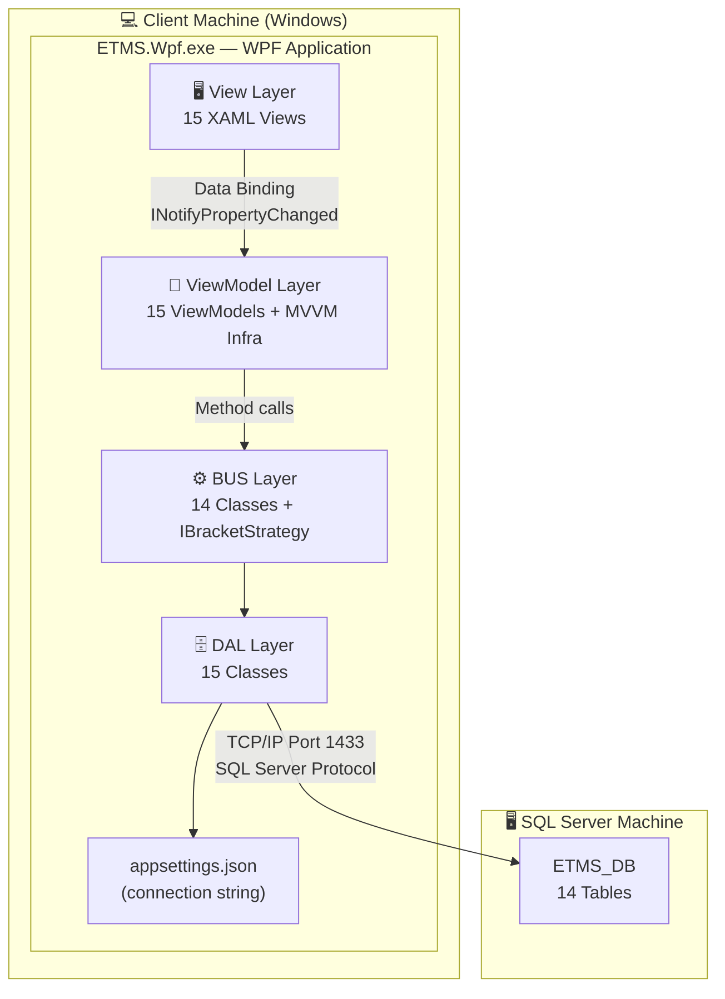
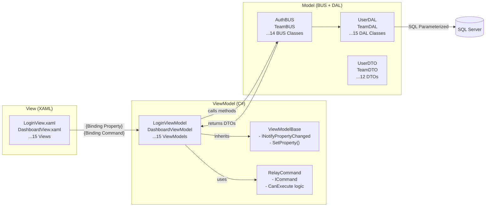
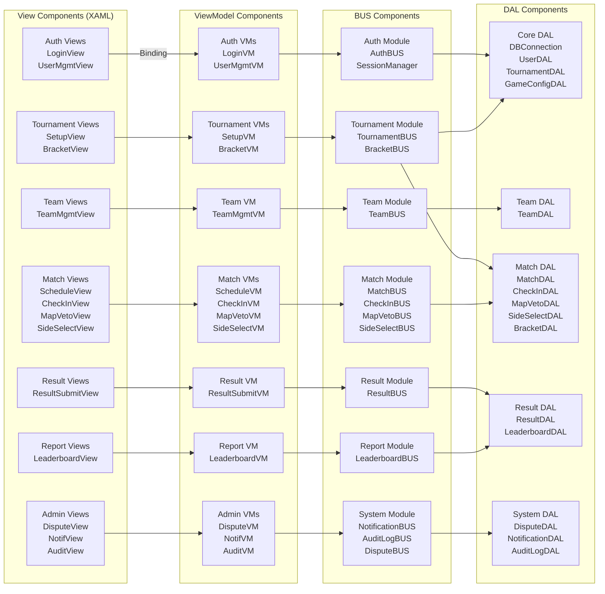
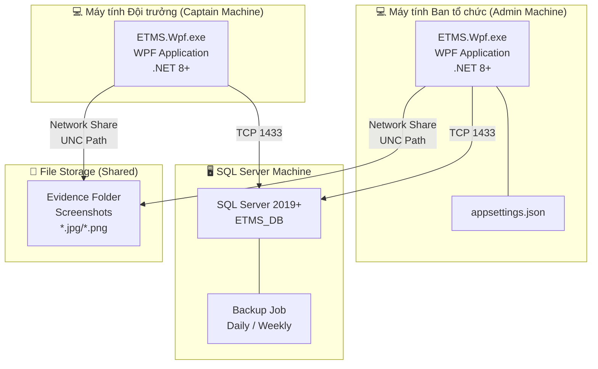
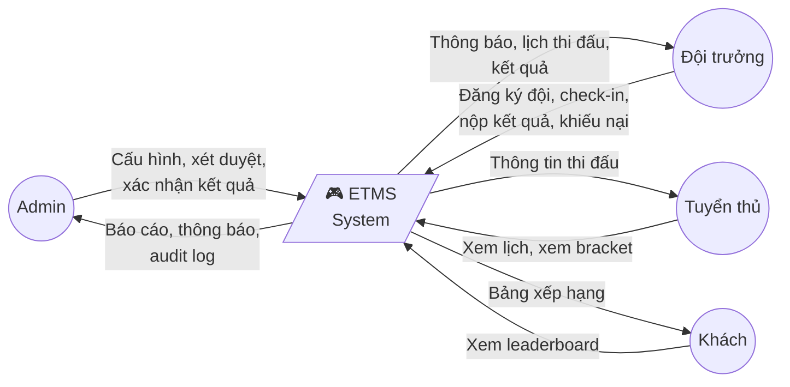

# KIẾN TRÚC HỆ THỐNG — ETMS v3.0
## Architecture Design Document (ADD)
**Phiên bản:** 3.0 (WPF/MVVM) | **Ngày:** 2026-03-29

---

## 1. KIẾN TRÚC TỔNG THỂ



> **Loại kiến trúc:** Thick Client / 2-Tier (Client-Server)
> - Client: WPF App với **MVVM Pattern** + 3-Layer Architecture nội bộ
> - Server: SQL Server 2019+
> - UI Pattern: **MVVM** (Model-View-ViewModel)

---

## 2. MVVM PATTERN DIAGRAM



### MVVM Infrastructure Classes

| Class | Mục đích |
|---|---|
| `ViewModelBase` | Abstract base — `INotifyPropertyChanged`, `SetProperty<T>()` helper |
| `RelayCommand` | Thay thế event `Button_Click` — `ICommand.Execute()` + `CanExecute()` |
| `RelayCommand<T>` | Generic version cho commands có parameter |
| `NavigationService` | Singleton — điều hướng Views thay `this.Hide(); form.Show()` |
| `DialogService` | Wrapper cho `MaterialDesignThemes.DialogHost` — testable |
| `ThemeService` | Toggle dark/light, load resource dictionaries |

---

## 3. COMPONENT DIAGRAM



---

## 4. DEPLOYMENT DIAGRAM



**Yêu cầu môi trường:**
- OS: Windows 10/11 (64-bit)
- Runtime: .NET 8.0+ Desktop Runtime
- SQL Server: 2019 Express (free) hoặc Standard
- RAM tối thiểu: 4GB (server), 2GB (client)
- Network: LAN 100Mbps

---

## 5. DATA FLOW DIAGRAM — Level 0 (Context)



---

## 6. ERROR HANDLING STRATEGY

### Phân loại lỗi theo tầng

| Tầng | Loại lỗi | Xử lý |
|---|---|---|
| **View** | Validation input | `MaterialDesignThemes.DialogHost` hoặc inline error message |
| **ViewModel** | Logic validation | Set `ErrorMessage` property → View binding hiển thị |
| **BUS** | Logic violation | Throw `BusinessException(code, message)` |
| **DAL** | SQL error | Catch `SqlException`, log vào `tblAuditLog`, throw `DataException` |
| **DAL** | Connection fail | Retry 3 lần (delay 500ms), throw `ConnectionException` |
| **System** | Unhandled | `Application.DispatcherUnhandledException` → log + dialog |

### Error Code Convention

```csharp
public enum ErrorCode {
    // Auth (1xxx)
    ERR_INVALID_CREDENTIALS = 1001,
    ERR_ACCOUNT_LOCKED = 1002,
    ERR_SESSION_EXPIRED = 1003,

    // Team (2xxx)
    ERR_TEAM_NAME_DUPLICATE = 2001,
    ERR_PLAYER_ALREADY_IN_TEAM = 2002,
    ERR_INSUFFICIENT_PLAYERS = 2003,
    ERR_CAPTAIN_ALREADY_HAS_TEAM = 2004,
    ERR_REGISTRATION_DEADLINE_PASSED = 2005,

    // Bracket (3xxx)
    ERR_INSUFFICIENT_TEAMS = 3001,
    ERR_BRACKET_ALREADY_EXISTS = 3002,

    // Check-in (4xxx)
    ERR_CHECKIN_WINDOW_CLOSED = 4001,
    ERR_ALREADY_CHECKEDIN = 4002,

    // File (5xxx)
    ERR_FILE_INVALID_EXTENSION = 5001,
    ERR_FILE_INVALID_MAGIC_BYTES = 5002,
    ERR_FILE_TOO_LARGE = 5003,

    // Result (6xxx)
    ERR_RESULT_ALREADY_SUBMITTED = 6001,
    ERR_MATCH_NOT_LIVE = 6002,

    // Dispute (7xxx)
    ERR_DISPUTE_LIMIT_REACHED = 7001,

    // DB (9xxx)
    ERR_DB_CONNECTION = 9001,
    ERR_DB_TRANSACTION = 9002,
}
```

---

## 7. CODING STANDARDS & CONVENTIONS

### Naming Convention

| Element | Convention | Ví dụ |
|---|---|---|
| **View** | `[Name]View` | `LoginView`, `BracketView` |
| **ViewModel** | `[Name]ViewModel` | `LoginViewModel`, `BracketViewModel` |
| BUS Class | `[Name]BUS` | `AuthBUS`, `TeamBUS` |
| DAL Class | `[Name]DAL` | `UserDAL`, `BracketDAL` |
| DTO Class | `[Name]DTO` | `UserDTO`, `MatchDTO` |
| Interface | `I` prefix | `IBracketStrategy`, `INavigationService` |
| Command | `[Action]Command` | `LoginCommand`, `ApproveTeamCommand` |
| XAML Resource | `[Type].[Name]` | `PrimaryBrush`, `CardStyle` |
| Method | PascalCase | `GenerateBracket()` |
| Variable | camelCase | `teamList`, `matchId` |
| Constant | UPPER_SNAKE | `MAX_FILE_SIZE_BYTES` |
| DB Table | `tbl` prefix | `tblUser`, `tblMatch` |

### Code Quality Requirements
- **View** chỉ bind vào ViewModel — **KHÔNG gọi BUS trực tiếp**
- **ViewModel** gọi BUS, set properties → View tự cập nhật qua binding
- **Mọi SQL** phải dùng `SqlParameter`
- **Mọi connection** phải trong `using` block
- **Mọi transaction** phải có `try-catch-rollback`
- **Mọi BUS method** kiểm tra `session.IsSessionValid()`
- **Mọi Admin action** gọi `auditBUS.Log()`

### WPF-Specific Guidelines
- Sử dụng `ObservableCollection<T>` thay vì `List<T>` cho danh sách hiển thị
- Sử dụng `ICollectionView` cho filter/sort thay vì tạo list mới
- Command parameter dùng `CommandParameter` binding, KHÔNG dùng Tag
- Sử dụng `DispatcherTimer` cho countdown thay vì `System.Windows.Forms.Timer`
- Static resources tập trung trong `Themes/` — không inline màu sắc

---

## 8. DATABASE CONNECTION STRATEGY — v3.0

### 8.1 Chuẩn WPF: IConfiguration (KHÔNG dùng ConfigurationManager)

```
appsettings.json  ──►  ConfigurationBuilder  ──►  DBConnection (Singleton)  ──►  SqlConnection × N
```

```csharp
// DAL/DBConnection.cs — cách đọc chuẩn WPF
private DBConnection()
{
    var config = new ConfigurationBuilder()
        .SetBasePath(AppDomain.CurrentDomain.BaseDirectory)
        .AddJsonFile("appsettings.json", optional: false, reloadOnChange: true)
        .Build();

    _connectionString = config.GetConnectionString("ETMSConnection")
        ?? throw new InvalidOperationException("Connection string không tìm thấy.");
}
```

### 8.2 appsettings.json

```json
{
  "ConnectionStrings": {
    "ETMSConnection": "Server=<host>\\<instance>;Database=ETMS_DB;Trusted_Connection=True;TrustServerCertificate=True;Max Pool Size=100;Min Pool Size=5;"
  },
  "AppSettings": {
    "SessionTimeoutMinutes": 30,
    "MaxFailedLoginAttempts": 5,
    "BcryptWorkFactor": 12,
    "MaxFileUploadSizeMB": 5,
    "DisputeSLAHours": 48,
    "MaxDisputesPerTournament": 2,
    "VetoTimeoutSeconds": 60,
    "CheckInWindowMinutes": 15
  }
}
```

### 8.3 Tóm tắt 16 Bảng Database

| Nhóm | Bảng |
|---|---|
| Auth | `tblUser` |
| Tournament | `tblTournament`, **`tblGameConfig`** *(BỔ SUNG v3.0)* |
| Team | `tblTeam`, `tblPlayer` |
| Match | `tblMatch`, `tblMatchResult`, `tblMapVeto`, `tblSideSelect` |
| Battle Royale | `tblBRRound`, `tblBRScore` |
| System | `tblDispute`, **`tblNotification`** *(BỔ SUNG v3.0)*, `tblAuditLog` |

Script: `ETMS.Wpf/Database/ETMS_DB.sql` — 16 bảng, 13 indexes, 1 computed column, 5 UNIQUE constraints.
